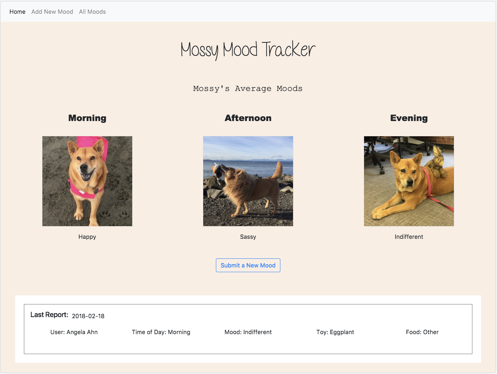

# Mossy Mood Tracker
Mossy is Galvanize Seattle's Data Science Dog. She is known to be a little fickle, and this tracker is intended to allow users to report interactions with her. Each submission is stored in a backend database, and interactions are displayed to help the user understand the best time of day to play with Mossy.

### Live URL: http://mossymoodtracker.surge.sh/
#### Frontend GitHub: https://github.com/aahn84/mossy-mood-tracker-frontend
#### Backend GitHub: https://github.com/aahn84/mossy-mood-tracker-backend

## Technologies
#### Frontend
- HTML
- CSS
- JavaScript
- CORS
- axios
- AJAX

#### Backend
- PostgreSQL
- Knex.js
- Node.js
- Express
- REST API
- JavaScript

## Features
- Mobile and web responsive
- Send and retrieve data from backend server using REST API

## Screenshots
### Home:

### Submit a New Mood:

### View and Filter Reported Moods:

